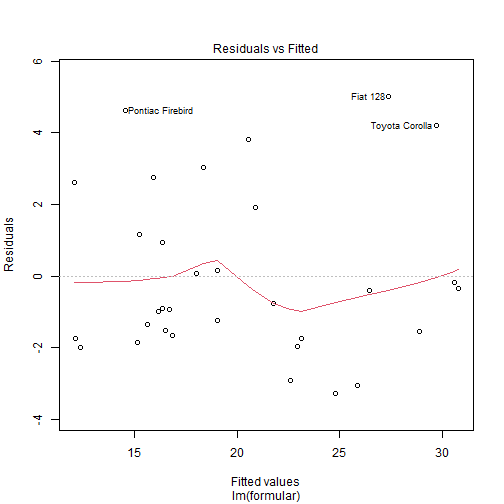
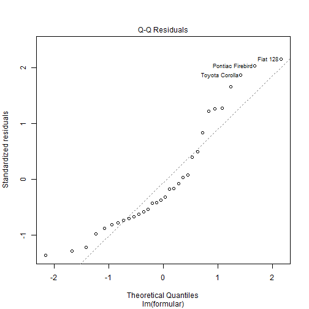
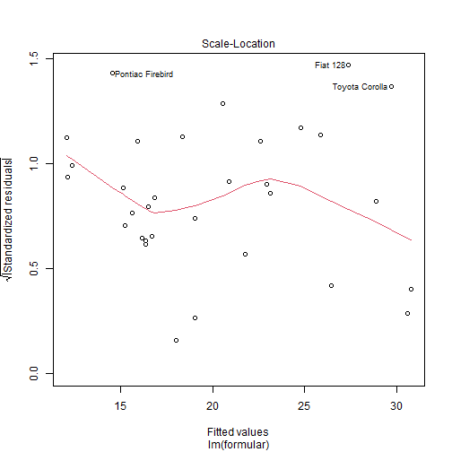
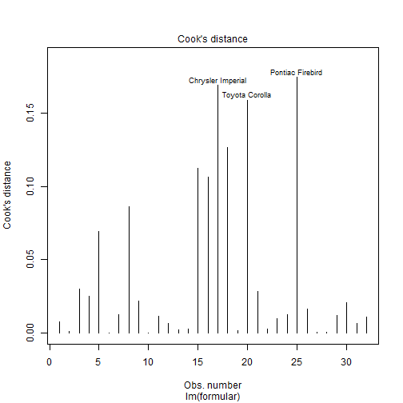
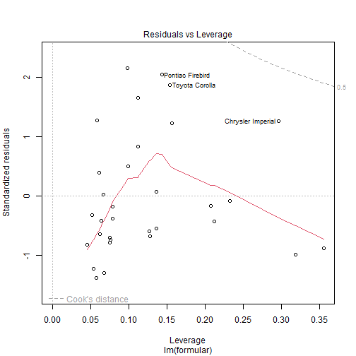
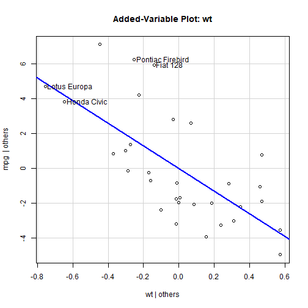

# 线性模型

## 线性模型估计

### 一元线性模型


```r
source("../linearmodel.R")
res <- linearmodel(weight~height, women)
```

```
## [1] "模型估计结果如下："
## 
## Call:
## lm(formula = formular, data = data)
## 
## Residuals:
##     Min      1Q  Median      3Q     Max 
## -1.7333 -1.1333 -0.3833  0.7417  3.1167 
## 
## Coefficients:
##              Estimate Std. Error t value Pr(>|t|)    
## (Intercept) -87.51667    5.93694  -14.74 1.71e-09 ***
## height        3.45000    0.09114   37.85 1.09e-14 ***
## ---
## Signif. codes:  0 '***' 0.001 '**' 0.01 '*' 0.05 '.' 0.1 ' ' 1
## 
## Residual standard error: 1.525 on 13 degrees of freedom
## Multiple R-squared:  0.991,	Adjusted R-squared:  0.9903 
## F-statistic:  1433 on 1 and 13 DF,  p-value: 1.091e-14
```

```r
print(res)
```

```
## $模型
## 
## Call:
## lm(formula = formular, data = data)
## 
## Coefficients:
## (Intercept)       height  
##      -87.52         3.45
```

### 多元线性模型


```r
source("../linearmodel.R")
res <- linearmodel(mpg~disp+hp+drat+wt+qsec, mtcars)
```

```
## [1] "模型估计结果如下："
## 
## Call:
## lm(formula = formular, data = data)
## 
## Residuals:
##     Min      1Q  Median      3Q     Max 
## -3.5404 -1.6701 -0.4264  1.1320  5.4996 
## 
## Coefficients:
##             Estimate Std. Error t value Pr(>|t|)   
## (Intercept) 16.53357   10.96423   1.508  0.14362   
## disp         0.00872    0.01119   0.779  0.44281   
## hp          -0.02060    0.01528  -1.348  0.18936   
## drat         2.01578    1.30946   1.539  0.13579   
## wt          -4.38546    1.24343  -3.527  0.00158 **
## qsec         0.64015    0.45934   1.394  0.17523   
## ---
## Signif. codes:  0 '***' 0.001 '**' 0.01 '*' 0.05 '.' 0.1 ' ' 1
## 
## Residual standard error: 2.558 on 26 degrees of freedom
## Multiple R-squared:  0.8489,	Adjusted R-squared:  0.8199 
## F-statistic: 29.22 on 5 and 26 DF,  p-value: 6.892e-10
```

```r
print(res)
```

```
## $模型
## 
## Call:
## lm(formula = formular, data = data)
## 
## Coefficients:
## (Intercept)         disp           hp         drat           wt         qsec  
##    16.53357      0.00872     -0.02060      2.01577     -4.38546      0.64015
```

### 带交互项的线性模型


```r
source("../linearmodel.R")
res <- linearmodel(mpg~disp+wt+disp*wt, mtcars)
```

```
## [1] "模型估计结果如下："
## 
## Call:
## lm(formula = formular, data = data)
## 
## Residuals:
##    Min     1Q Median     3Q    Max 
## -3.267 -1.677 -0.836  1.351  5.017 
## 
## Coefficients:
##              Estimate Std. Error t value Pr(>|t|)    
## (Intercept) 44.081998   3.123063  14.115 2.96e-14 ***
## disp        -0.056358   0.013239  -4.257  0.00021 ***
## wt          -6.495680   1.313383  -4.946 3.22e-05 ***
## disp:wt      0.011705   0.003255   3.596  0.00123 ** 
## ---
## Signif. codes:  0 '***' 0.001 '**' 0.01 '*' 0.05 '.' 0.1 ' ' 1
## 
## Residual standard error: 2.455 on 28 degrees of freedom
## Multiple R-squared:  0.8501,	Adjusted R-squared:  0.8341 
## F-statistic: 52.95 on 3 and 28 DF,  p-value: 1.158e-11
```

```r
print(res)
```

```
## $模型
## 
## Call:
## lm(formula = formular, data = data)
## 
## Coefficients:
## (Intercept)         disp           wt      disp:wt  
##    44.08200     -0.05636     -6.49568      0.01171
```
### 不带截距项的模型


```r
source("../linearmodel.R")
res <- linearmodel(mpg~disp+wt-1, mtcars)
```

```
## [1] "模型估计结果如下："
## 
## Call:
## lm(formula = formular, data = data)
## 
## Residuals:
##      Min       1Q   Median       3Q      Max 
## -12.9975  -3.5271   0.9197  10.1182  20.5392 
## 
## Coefficients:
##      Estimate Std. Error t value Pr(>|t|)    
## disp -0.10038    0.02373  -4.230 0.000202 ***
## wt   12.82694    1.84406   6.956    1e-07 ***
## ---
## Signif. codes:  0 '***' 0.001 '**' 0.01 '*' 0.05 '.' 0.1 ' ' 1
## 
## Residual standard error: 9.066 on 30 degrees of freedom
## Multiple R-squared:  0.8244,	Adjusted R-squared:  0.8127 
## F-statistic: 70.42 on 2 and 30 DF,  p-value: 4.652e-12
```

```r
print(res)
```

```
## $模型
## 
## Call:
## lm(formula = formular, data = data)
## 
## Coefficients:
##    disp       wt  
## -0.1004  12.8269
```

### 使用剩下所有变量回归


```r
source("../linearmodel.R")
res <- linearmodel(mpg~., mtcars)
```

```
## [1] "模型估计结果如下："
## 
## Call:
## lm(formula = formular, data = data)
## 
## Residuals:
##     Min      1Q  Median      3Q     Max 
## -3.4506 -1.6044 -0.1196  1.2193  4.6271 
## 
## Coefficients:
##             Estimate Std. Error t value Pr(>|t|)  
## (Intercept) 12.30337   18.71788   0.657   0.5181  
## cyl         -0.11144    1.04502  -0.107   0.9161  
## disp         0.01334    0.01786   0.747   0.4635  
## hp          -0.02148    0.02177  -0.987   0.3350  
## drat         0.78711    1.63537   0.481   0.6353  
## wt          -3.71530    1.89441  -1.961   0.0633 .
## qsec         0.82104    0.73084   1.123   0.2739  
## vs           0.31776    2.10451   0.151   0.8814  
## am           2.52023    2.05665   1.225   0.2340  
## gear         0.65541    1.49326   0.439   0.6652  
## carb        -0.19942    0.82875  -0.241   0.8122  
## ---
## Signif. codes:  0 '***' 0.001 '**' 0.01 '*' 0.05 '.' 0.1 ' ' 1
## 
## Residual standard error: 2.65 on 21 degrees of freedom
## Multiple R-squared:  0.869,	Adjusted R-squared:  0.8066 
## F-statistic: 13.93 on 10 and 21 DF,  p-value: 3.793e-07
```

```r
print(res)
```

```
## $模型
## 
## Call:
## lm(formula = formular, data = data)
## 
## Coefficients:
## (Intercept)          cyl         disp           hp         drat           wt         qsec  
##    12.30337     -0.11144      0.01334     -0.02148      0.78711     -3.71530      0.82104  
##          vs           am         gear         carb  
##     0.31776      2.52023      0.65541     -0.19942
```

## 线性模型方差分析


```r
source("../linearmodel.R")
res <- linearmodel(mpg~wt+disp+disp*wt, mtcars, is.anova=1)
```

```
## [1] "模型估计结果如下："
## 
## Call:
## lm(formula = formular, data = data)
## 
## Residuals:
##    Min     1Q Median     3Q    Max 
## -3.267 -1.677 -0.836  1.351  5.017 
## 
## Coefficients:
##              Estimate Std. Error t value Pr(>|t|)    
## (Intercept) 44.081998   3.123063  14.115 2.96e-14 ***
## wt          -6.495680   1.313383  -4.946 3.22e-05 ***
## disp        -0.056358   0.013239  -4.257  0.00021 ***
## wt:disp      0.011705   0.003255   3.596  0.00123 ** 
## ---
## Signif. codes:  0 '***' 0.001 '**' 0.01 '*' 0.05 '.' 0.1 ' ' 1
## 
## Residual standard error: 2.455 on 28 degrees of freedom
## Multiple R-squared:  0.8501,	Adjusted R-squared:  0.8341 
## F-statistic: 52.95 on 3 and 28 DF,  p-value: 1.158e-11
## 
## [1] "方差分析结果如下："
## Analysis of Variance Table
## 
## Response: mpg
##           Df Sum Sq Mean Sq  F value    Pr(>F)    
## wt         1 847.73  847.73 140.6608 1.964e-12 ***
## disp       1  31.64   31.64   5.2498  0.029679 *  
## wt:disp    1  77.93   77.93  12.9314  0.001227 ** 
## Residuals 28 168.75    6.03                       
## ---
## Signif. codes:  0 '***' 0.001 '**' 0.01 '*' 0.05 '.' 0.1 ' ' 1
```

```r
print(res)
```

```
## $模型
## 
## Call:
## lm(formula = formular, data = data)
## 
## Coefficients:
## (Intercept)           wt         disp      wt:disp  
##    44.08200     -6.49568     -0.05636      0.01171  
## 
## 
## $方差分析表
## Analysis of Variance Table
## 
## Response: mpg
##           Df Sum Sq Mean Sq  F value    Pr(>F)    
## wt         1 847.73  847.73 140.6608 1.964e-12 ***
## disp       1  31.64   31.64   5.2498  0.029679 *  
## wt:disp    1  77.93   77.93  12.9314  0.001227 ** 
## Residuals 28 168.75    6.03                       
## ---
## Signif. codes:  0 '***' 0.001 '**' 0.01 '*' 0.05 '.' 0.1 ' ' 1
```

## 获取估计系数


```r
source("../linearmodel.R")
res <- linearmodel(mpg~wt+disp+disp*wt, mtcars, is.coef=1)
```

```
## [1] "模型估计结果如下："
## 
## Call:
## lm(formula = formular, data = data)
## 
## Residuals:
##    Min     1Q Median     3Q    Max 
## -3.267 -1.677 -0.836  1.351  5.017 
## 
## Coefficients:
##              Estimate Std. Error t value Pr(>|t|)    
## (Intercept) 44.081998   3.123063  14.115 2.96e-14 ***
## wt          -6.495680   1.313383  -4.946 3.22e-05 ***
## disp        -0.056358   0.013239  -4.257  0.00021 ***
## wt:disp      0.011705   0.003255   3.596  0.00123 ** 
## ---
## Signif. codes:  0 '***' 0.001 '**' 0.01 '*' 0.05 '.' 0.1 ' ' 1
## 
## Residual standard error: 2.455 on 28 degrees of freedom
## Multiple R-squared:  0.8501,	Adjusted R-squared:  0.8341 
## F-statistic: 52.95 on 3 and 28 DF,  p-value: 1.158e-11
## 
## [1] "系数估计结果如下："
## (Intercept)          wt        disp     wt:disp 
## 44.08199770 -6.49567966 -0.05635816  0.01170542
```

```r
print(res)
```

```
## $模型
## 
## Call:
## lm(formula = formular, data = data)
## 
## Coefficients:
## (Intercept)           wt         disp      wt:disp  
##    44.08200     -6.49568     -0.05636      0.01171  
## 
## 
## $系数
## (Intercept)          wt        disp     wt:disp 
## 44.08199770 -6.49567966 -0.05635816  0.01170542
```

## 获取残差


```r
source("../linearmodel.R")
res <- linearmodel(mpg~wt+disp+disp*wt, mtcars, is.residuals = 1)
```

```
## [1] "模型估计结果如下："
## 
## Call:
## lm(formula = formular, data = data)
## 
## Residuals:
##    Min     1Q Median     3Q    Max 
## -3.267 -1.677 -0.836  1.351  5.017 
## 
## Coefficients:
##              Estimate Std. Error t value Pr(>|t|)    
## (Intercept) 44.081998   3.123063  14.115 2.96e-14 ***
## wt          -6.495680   1.313383  -4.946 3.22e-05 ***
## disp        -0.056358   0.013239  -4.257  0.00021 ***
## wt:disp      0.011705   0.003255   3.596  0.00123 ** 
## ---
## Signif. codes:  0 '***' 0.001 '**' 0.01 '*' 0.05 '.' 0.1 ' ' 1
## 
## Residual standard error: 2.455 on 28 degrees of freedom
## Multiple R-squared:  0.8501,	Adjusted R-squared:  0.8341 
## F-statistic: 52.95 on 3 and 28 DF,  p-value: 1.158e-11
## 
## [1] "残差结果如下："
##           Mazda RX4       Mazda RX4 Wag          Datsun 710      Hornet 4 Drive 
##         -1.95292297         -0.77410571         -3.05824938          3.03272404 
##   Hornet Sportabout             Valiant          Duster 360           Merc 240D 
##          2.75608748          0.06097151         -1.34728773          3.82914258 
##            Merc 230            Merc 280           Merc 280C          Merc 450SE 
##          1.92303485          0.16007906         -1.23992094          1.15959649 
##          Merc 450SL         Merc 450SLC  Cadillac Fleetwood Lincoln Continental 
##          0.94870587         -0.98792787         -1.98465481         -1.73016477 
##   Chrysler Imperial            Fiat 128         Honda Civic      Toyota Corolla 
##          2.60619746          5.01720850         -0.35621424          4.21745117 
##       Toyota Corona    Dodge Challenger         AMC Javelin          Camaro Z28 
##         -3.26688062         -0.89788782         -1.65972380         -1.84531437 
##    Pontiac Firebird           Fiat X1-9       Porsche 914-2        Lotus Europa 
##          4.63422082         -1.54991182         -0.41482307         -0.17862286 
##      Ford Pantera L        Ferrari Dino       Maserati Bora          Volvo 142E 
##         -0.93324724         -2.91851331         -1.50690684         -1.74213966
```

```r
print(res)
```

```
## $模型
## 
## Call:
## lm(formula = formular, data = data)
## 
## Coefficients:
## (Intercept)           wt         disp      wt:disp  
##    44.08200     -6.49568     -0.05636      0.01171  
## 
## 
## $残差
##           Mazda RX4       Mazda RX4 Wag          Datsun 710      Hornet 4 Drive 
##         -1.95292297         -0.77410571         -3.05824938          3.03272404 
##   Hornet Sportabout             Valiant          Duster 360           Merc 240D 
##          2.75608748          0.06097151         -1.34728773          3.82914258 
##            Merc 230            Merc 280           Merc 280C          Merc 450SE 
##          1.92303485          0.16007906         -1.23992094          1.15959649 
##          Merc 450SL         Merc 450SLC  Cadillac Fleetwood Lincoln Continental 
##          0.94870587         -0.98792787         -1.98465481         -1.73016477 
##   Chrysler Imperial            Fiat 128         Honda Civic      Toyota Corolla 
##          2.60619746          5.01720850         -0.35621424          4.21745117 
##       Toyota Corona    Dodge Challenger         AMC Javelin          Camaro Z28 
##         -3.26688062         -0.89788782         -1.65972380         -1.84531437 
##    Pontiac Firebird           Fiat X1-9       Porsche 914-2        Lotus Europa 
##          4.63422082         -1.54991182         -0.41482307         -0.17862286 
##      Ford Pantera L        Ferrari Dino       Maserati Bora          Volvo 142E 
##         -0.93324724         -2.91851331         -1.50690684         -1.74213966
```

## 获取拟合值


```r
source("../linearmodel.R")
res <- linearmodel(mpg~wt+disp+disp*wt, mtcars, is.fittedvalue = 1)
```

```
## [1] "模型估计结果如下："
## 
## Call:
## lm(formula = formular, data = data)
## 
## Residuals:
##    Min     1Q Median     3Q    Max 
## -3.267 -1.677 -0.836  1.351  5.017 
## 
## Coefficients:
##              Estimate Std. Error t value Pr(>|t|)    
## (Intercept) 44.081998   3.123063  14.115 2.96e-14 ***
## wt          -6.495680   1.313383  -4.946 3.22e-05 ***
## disp        -0.056358   0.013239  -4.257  0.00021 ***
## wt:disp      0.011705   0.003255   3.596  0.00123 ** 
## ---
## Signif. codes:  0 '***' 0.001 '**' 0.01 '*' 0.05 '.' 0.1 ' ' 1
## 
## Residual standard error: 2.455 on 28 degrees of freedom
## Multiple R-squared:  0.8501,	Adjusted R-squared:  0.8341 
## F-statistic: 52.95 on 3 and 28 DF,  p-value: 1.158e-11
## 
## [1] "拟合值结果如下："
##           Mazda RX4       Mazda RX4 Wag          Datsun 710      Hornet 4 Drive 
##            22.95292            21.77411            25.85825            18.36728 
##   Hornet Sportabout             Valiant          Duster 360           Merc 240D 
##            15.94391            18.03903            15.64729            20.57086 
##            Merc 230            Merc 280           Merc 280C          Merc 450SE 
##            20.87697            19.03992            19.03992            15.24040 
##          Merc 450SL         Merc 450SLC  Cadillac Fleetwood Lincoln Continental 
##            16.35129            16.18793            12.38465            12.13016 
##   Chrysler Imperial            Fiat 128         Honda Civic      Toyota Corolla 
##            12.09380            27.38279            30.75621            29.68255 
##       Toyota Corona    Dodge Challenger         AMC Javelin          Camaro Z28 
##            24.76688            16.39789            16.85972            15.14531 
##    Pontiac Firebird           Fiat X1-9       Porsche 914-2        Lotus Europa 
##            14.56578            28.84991            26.41482            30.57862 
##      Ford Pantera L        Ferrari Dino       Maserati Bora          Volvo 142E 
##            16.73325            22.61851            16.50691            23.14214
```

```r
print(res)
```

```
## $模型
## 
## Call:
## lm(formula = formular, data = data)
## 
## Coefficients:
## (Intercept)           wt         disp      wt:disp  
##    44.08200     -6.49568     -0.05636      0.01171  
## 
## 
## $拟合值
##           Mazda RX4       Mazda RX4 Wag          Datsun 710      Hornet 4 Drive 
##            22.95292            21.77411            25.85825            18.36728 
##   Hornet Sportabout             Valiant          Duster 360           Merc 240D 
##            15.94391            18.03903            15.64729            20.57086 
##            Merc 230            Merc 280           Merc 280C          Merc 450SE 
##            20.87697            19.03992            19.03992            15.24040 
##          Merc 450SL         Merc 450SLC  Cadillac Fleetwood Lincoln Continental 
##            16.35129            16.18793            12.38465            12.13016 
##   Chrysler Imperial            Fiat 128         Honda Civic      Toyota Corolla 
##            12.09380            27.38279            30.75621            29.68255 
##       Toyota Corona    Dodge Challenger         AMC Javelin          Camaro Z28 
##            24.76688            16.39789            16.85972            15.14531 
##    Pontiac Firebird           Fiat X1-9       Porsche 914-2        Lotus Europa 
##            14.56578            28.84991            26.41482            30.57862 
##      Ford Pantera L        Ferrari Dino       Maserati Bora          Volvo 142E 
##            16.73325            22.61851            16.50691            23.14214
```

## 影响点分析


```r
source("../linearmodel.R")
res <- linearmodel(mpg~wt+disp+disp*wt, mtcars, is.influence = 1)
```

```
## [1] "模型估计结果如下："
## 
## Call:
## lm(formula = formular, data = data)
## 
## Residuals:
##    Min     1Q Median     3Q    Max 
## -3.267 -1.677 -0.836  1.351  5.017 
## 
## Coefficients:
##              Estimate Std. Error t value Pr(>|t|)    
## (Intercept) 44.081998   3.123063  14.115 2.96e-14 ***
## wt          -6.495680   1.313383  -4.946 3.22e-05 ***
## disp        -0.056358   0.013239  -4.257  0.00021 ***
## wt:disp      0.011705   0.003255   3.596  0.00123 ** 
## ---
## Signif. codes:  0 '***' 0.001 '**' 0.01 '*' 0.05 '.' 0.1 ' ' 1
## 
## Residual standard error: 2.455 on 28 degrees of freedom
## Multiple R-squared:  0.8501,	Adjusted R-squared:  0.8341 
## F-statistic: 52.95 on 3 and 28 DF,  p-value: 1.158e-11
## 
## [1] "影响值结果如下："
## Influence measures of
## 	 lm(formula = formular, data = data) :
## 
##                       dfb.1_    dfb.wt dfb.disp dfb.wt.d    dffit cov.r   cook.d    hat inf
## Mazda RX4           -0.02958  0.000505 -0.02448  0.03682 -0.17640 1.101 7.88e-03 0.0454    
## Mazda RX4 Wag        0.01480 -0.032659 -0.00215  0.02658 -0.07470 1.202 1.44e-03 0.0521    
## Datsun 710          -0.17937  0.074652  0.12715 -0.08977 -0.35143 0.971 3.01e-02 0.0675    
## Hornet 4 Drive      -0.08209  0.048426  0.21957 -0.18762  0.32182 0.968 2.53e-02 0.0587    
## Hornet Sportabout    0.01377 -0.161088  0.39475 -0.16875  0.53156 1.101 6.93e-02 0.1566    
## Valiant             -0.00400  0.004844  0.00163 -0.00397  0.00677 1.240 1.19e-05 0.0671    
## Duster 360           0.00187  0.056962 -0.15790  0.06826 -0.22162 1.261 1.26e-02 0.1272    
## Merc 240D           -0.28547  0.454452 -0.08701 -0.22632  0.60736 0.863 8.63e-02 0.1119    
## Merc 230            -0.13079  0.215530 -0.04976 -0.10267  0.29427 1.179 2.19e-02 0.1124    
## Merc 280            -0.01598  0.022642 -0.00234 -0.01195  0.02735 1.338 1.94e-04 0.1361    
## Merc 280C            0.12444 -0.176294  0.01820  0.09304 -0.21294 1.283 1.16e-02 0.1361    
## Merc 450SE          -0.10866  0.129314  0.00835 -0.06998  0.16340 1.240 6.86e-03 0.0997    
## Merc 450SL          -0.05854  0.061097  0.03613 -0.05610  0.09996 1.204 2.58e-03 0.0609    
## Merc 450SLC          0.06528 -0.070044 -0.03322  0.05845 -0.10738 1.206 2.97e-03 0.0643    
## Cadillac Fleetwood  -0.20806  0.181986  0.34110 -0.45433 -0.66964 1.477 1.12e-01 0.3188   *
## Lincoln Continental -0.15140  0.092967  0.38832 -0.43171 -0.64999 1.606 1.07e-01 0.3559   *
## Chrysler Imperial    0.11291 -0.026935 -0.48313  0.49131  0.83081 1.299 1.69e-01 0.2964    
## Fiat 128             0.44375 -0.183323 -0.43497  0.32813  0.76384 0.622 1.26e-01 0.0983    
## Honda Civic         -0.07579  0.062191  0.03380 -0.05193 -0.08192 1.454 1.74e-03 0.2074   *
## Toyota Corolla       0.71223 -0.509682 -0.43381  0.51451  0.83662 0.803 1.59e-01 0.1541    
## Toyota Corona       -0.11479  0.011161  0.09446 -0.03168 -0.34429 0.929 2.87e-02 0.0575    
## Dodge Challenger     0.01987  0.002626 -0.07897  0.05010 -0.10980 1.230 3.11e-03 0.0789    
## AMC Javelin          0.03959 -0.001856 -0.14510  0.09864 -0.19836 1.164 1.00e-02 0.0750    
## Camaro Z28           0.03761  0.005981 -0.12842  0.06807 -0.22181 1.145 1.25e-02 0.0755    
## Pontiac Firebird     0.07822 -0.315927  0.51689 -0.11184  0.88841 0.710 1.74e-01 0.1435    
## Fiat X1-9           -0.20729  0.142489  0.12670 -0.14393 -0.25590 1.241 1.67e-02 0.1276    
## Porsche 914-2       -0.03551  0.026566  0.00898 -0.01546 -0.05061 1.250 6.63e-04 0.0789    
## Lotus Europa        -0.04149  0.037565  0.01070 -0.02504 -0.04491 1.506 5.23e-04 0.2326   *
## Ford Pantera L      -0.01419  0.076472 -0.17049  0.07455 -0.21925 1.431 1.24e-02 0.2125   *
## Ferrari Dino         0.02367 -0.104887  0.02555  0.07039 -0.29330 0.981 2.11e-02 0.0535    
## Maserati Bora        0.05212 -0.029466 -0.10524  0.08475 -0.16101 1.164 6.62e-03 0.0619    
## Volvo 142E           0.02522 -0.095847  0.05979  0.03091 -0.20954 1.157 1.12e-02 0.0757
```

```r
print(res)
```

```
## $模型
## 
## Call:
## lm(formula = formular, data = data)
## 
## Coefficients:
## (Intercept)           wt         disp      wt:disp  
##    44.08200     -6.49568     -0.05636      0.01171  
## 
## 
## $影响值
##                           dfb.1_        dfb.wt     dfb.disp     dfb.wt:d        dffit
## Mazda RX4           -0.029579895  0.0005053551 -0.024476436  0.036821538 -0.176401388
## Mazda RX4 Wag        0.014797317 -0.0326594848 -0.002146683  0.026576075 -0.074704568
## Datsun 710          -0.179372949  0.0746516029  0.127149895 -0.089771587 -0.351432619
## Hornet 4 Drive      -0.082090412  0.0484257193  0.219567358 -0.187619426  0.321819698
## Hornet Sportabout    0.013773393 -0.1610882132  0.394753326 -0.168747585  0.531559710
## Valiant             -0.004004422  0.0048436450  0.001629532 -0.003967051  0.006771599
## Duster 360           0.001867963  0.0569624831 -0.157904543  0.068263018 -0.221623318
## Merc 240D           -0.285469053  0.4544522331 -0.087006461 -0.226317665  0.607362171
## Merc 230            -0.130788060  0.2155297961 -0.049759994 -0.102672089  0.294267730
## Merc 280            -0.015982492  0.0226419883 -0.002337942 -0.011949714  0.027348032
## Merc 280C            0.124442294 -0.1762942219  0.018203597  0.093042429 -0.212936249
## Merc 450SE          -0.108661392  0.1293135949  0.008348615 -0.069981528  0.163404237
## Merc 450SL          -0.058540842  0.0610967289  0.036129277 -0.056101368  0.099960631
## Merc 450SLC          0.065279040 -0.0700441240 -0.033219965  0.058447593 -0.107379375
## Cadillac Fleetwood  -0.208060125  0.1819863931  0.341098697 -0.454332115 -0.669637571
## Lincoln Continental -0.151397761  0.0929669411  0.388320164 -0.431707856 -0.649986194
## Chrysler Imperial    0.112913306 -0.0269354499 -0.483129091  0.491307661  0.830807819
## Fiat 128             0.443753201 -0.1833227790 -0.434969341  0.328129130  0.763835480
## Honda Civic         -0.075793907  0.0621911935  0.033800060 -0.051933331 -0.081916005
## Toyota Corolla       0.712234089 -0.5096818616 -0.433811512  0.514505988  0.836616355
## Toyota Corona       -0.114793020  0.0111608493  0.094463456 -0.031684781 -0.344289045
## Dodge Challenger     0.019871025  0.0026259483 -0.078967619  0.050097172 -0.109802712
## AMC Javelin          0.039594003 -0.0018555363 -0.145095627  0.098635146 -0.198364035
## Camaro Z28           0.037611283  0.0059808548 -0.128420825  0.068071288 -0.221806855
## Pontiac Firebird     0.078217672 -0.3159267093  0.516886840 -0.111840232  0.888409595
## Fiat X1-9           -0.207290069  0.1424887429  0.126695147 -0.143934657 -0.255900237
## Porsche 914-2       -0.035512252  0.0265664489  0.008981328 -0.015461630 -0.050612449
## Lotus Europa        -0.041489040  0.0375650029  0.010703293 -0.025035889 -0.044911472
## Ford Pantera L      -0.014193029  0.0764721276 -0.170486267  0.074551956 -0.219254378
## Ferrari Dino         0.023673753 -0.1048874560  0.025548571  0.070387689 -0.293295013
## Maserati Bora        0.052116615 -0.0294661198 -0.105243815  0.084751240 -0.161005731
## Volvo 142E           0.025221851 -0.0958472069  0.059790191  0.030913711 -0.209537155
##                         cov.r       cook.d        hat
## Mazda RX4           1.1008277 7.876487e-03 0.04537054
## Mazda RX4 Wag       1.2019758 1.441447e-03 0.05210295
## Datsun 710          0.9706879 3.011663e-02 0.06749951
## Hornet 4 Drive      0.9679366 2.529613e-02 0.05874188
## Hornet Sportabout   1.1011473 6.934560e-02 0.15656066
## Valiant             1.2396450 1.188794e-05 0.06709219
## Duster 360          1.2610577 1.257706e-02 0.12723242
## Merc 240D           0.8626868 8.628107e-02 0.11188932
## Merc 230            1.1790952 2.189585e-02 0.11244085
## Merc 280            1.3378716 1.938698e-04 0.13611236
## Merc 280C           1.2832230 1.163132e-02 0.13611236
## Merc 450SE          1.2397853 6.861197e-03 0.09970140
## Merc 450SL          1.2037840 2.575839e-03 0.06085086
## Merc 450SLC         1.2057239 2.970868e-03 0.06425279
## Cadillac Fleetwood  1.4768930 1.122719e-01 0.31882808
## Lincoln Continental 1.6058293 1.065158e-01 0.35588433
## Chrysler Imperial   1.2987505 1.687140e-01 0.29641922
## Fiat 128            0.6222422 1.262395e-01 0.09829698
## Honda Civic         1.4537428 1.738039e-03 0.20742458
## Toyota Corolla      0.8029040 1.588520e-01 0.15406619
## Toyota Corona       0.9294728 2.866906e-02 0.05752169
## Dodge Challenger    1.2297928 3.109582e-03 0.07889013
## AMC Javelin         1.1644437 1.002137e-02 0.07503265
## Camaro Z28          1.1453305 1.247671e-02 0.07549523
## Pontiac Firebird    0.7095829 1.742218e-01 0.14347372
## Fiat X1-9           1.2412633 1.670055e-02 0.12756351
## Porsche 914-2       1.2500451 6.633885e-04 0.07885669
## Lotus Europa        1.5056895 5.228075e-04 0.23261455
## Ford Pantera L      1.4305890 1.238155e-02 0.21252091
## Ferrari Dino        0.9814376 2.111262e-02 0.05352747
## Maserati Bora       1.1636549 6.624334e-03 0.06188980
## Volvo 142E          1.1567580 1.116148e-02 0.07573416
```

## 获取标准化残差


```r
source("../linearmodel.R")
res <- linearmodel(mpg~wt+disp+disp*wt, mtcars, is.rstandard=1)
```

```
## [1] "模型估计结果如下："
## 
## Call:
## lm(formula = formular, data = data)
## 
## Residuals:
##    Min     1Q Median     3Q    Max 
## -3.267 -1.677 -0.836  1.351  5.017 
## 
## Coefficients:
##              Estimate Std. Error t value Pr(>|t|)    
## (Intercept) 44.081998   3.123063  14.115 2.96e-14 ***
## wt          -6.495680   1.313383  -4.946 3.22e-05 ***
## disp        -0.056358   0.013239  -4.257  0.00021 ***
## wt:disp      0.011705   0.003255   3.596  0.00123 ** 
## ---
## Signif. codes:  0 '***' 0.001 '**' 0.01 '*' 0.05 '.' 0.1 ' ' 1
## 
## Residual standard error: 2.455 on 28 degrees of freedom
## Multiple R-squared:  0.8501,	Adjusted R-squared:  0.8341 
## F-statistic: 52.95 on 3 and 28 DF,  p-value: 1.158e-11
## 
## [1] "标准化残差结果如下："
##           Mazda RX4       Mazda RX4 Wag          Datsun 710      Hornet 4 Drive 
##         -0.81419175         -0.32387594         -1.29005244          1.27331990 
##   Hornet Sportabout             Valiant          Duster 360           Merc 240D 
##          1.22243302          0.02571382         -0.58744884          1.65511050 
##            Merc 230            Merc 280           Merc 280C          Merc 450SE 
##          0.83147176          0.07015601         -0.54340592          0.49782030 
##          Merc 450SL         Merc 450SLC  Cadillac Fleetwood Lincoln Continental 
##          0.39877076         -0.41601114         -0.97952520         -0.87814156 
##   Chrysler Imperial            Fiat 128         Honda Civic      Toyota Corolla 
##          1.26563750          2.15223350         -0.16298588          1.86784516 
##       Toyota Corona    Dodge Challenger         AMC Javelin          Camaro Z28 
##         -1.37074472         -0.38108808         -0.70296163         -0.78176242 
##    Pontiac Firebird           Fiat X1-9       Porsche 914-2        Lotus Europa 
##          2.03969570         -0.67592589         -0.17605903         -0.08305949 
##      Ford Pantera L        Ferrari Dino       Maserati Bora          Volvo 142E 
##         -0.42838692         -1.22198724         -0.63375074         -0.73814812
```

```r
print(res)
```

```
## $模型
## 
## Call:
## lm(formula = formular, data = data)
## 
## Coefficients:
## (Intercept)           wt         disp      wt:disp  
##    44.08200     -6.49568     -0.05636      0.01171  
## 
## 
## $标准化残差
##           Mazda RX4       Mazda RX4 Wag          Datsun 710      Hornet 4 Drive 
##         -0.81419175         -0.32387594         -1.29005244          1.27331990 
##   Hornet Sportabout             Valiant          Duster 360           Merc 240D 
##          1.22243302          0.02571382         -0.58744884          1.65511050 
##            Merc 230            Merc 280           Merc 280C          Merc 450SE 
##          0.83147176          0.07015601         -0.54340592          0.49782030 
##          Merc 450SL         Merc 450SLC  Cadillac Fleetwood Lincoln Continental 
##          0.39877076         -0.41601114         -0.97952520         -0.87814156 
##   Chrysler Imperial            Fiat 128         Honda Civic      Toyota Corolla 
##          1.26563750          2.15223350         -0.16298588          1.86784516 
##       Toyota Corona    Dodge Challenger         AMC Javelin          Camaro Z28 
##         -1.37074472         -0.38108808         -0.70296163         -0.78176242 
##    Pontiac Firebird           Fiat X1-9       Porsche 914-2        Lotus Europa 
##          2.03969570         -0.67592589         -0.17605903         -0.08305949 
##      Ford Pantera L        Ferrari Dino       Maserati Bora          Volvo 142E 
##         -0.42838692         -1.22198724         -0.63375074         -0.73814812
```

## 获取学生化残差


```r
source("../linearmodel.R")
res <- linearmodel(mpg~wt+disp+disp*wt, mtcars, is.rstudent=1)
```

```
## [1] "模型估计结果如下："
## 
## Call:
## lm(formula = formular, data = data)
## 
## Residuals:
##    Min     1Q Median     3Q    Max 
## -3.267 -1.677 -0.836  1.351  5.017 
## 
## Coefficients:
##              Estimate Std. Error t value Pr(>|t|)    
## (Intercept) 44.081998   3.123063  14.115 2.96e-14 ***
## wt          -6.495680   1.313383  -4.946 3.22e-05 ***
## disp        -0.056358   0.013239  -4.257  0.00021 ***
## wt:disp      0.011705   0.003255   3.596  0.00123 ** 
## ---
## Signif. codes:  0 '***' 0.001 '**' 0.01 '*' 0.05 '.' 0.1 ' ' 1
## 
## Residual standard error: 2.455 on 28 degrees of freedom
## Multiple R-squared:  0.8501,	Adjusted R-squared:  0.8341 
## F-statistic: 52.95 on 3 and 28 DF,  p-value: 1.158e-11
## 
## [1] "学生化残差结果如下："
##           Mazda RX4       Mazda RX4 Wag          Datsun 710      Hornet 4 Drive 
##         -0.80915631         -0.31863727         -1.30621985          1.28822901 
##   Hornet Sportabout             Valiant          Duster 360           Merc 240D 
##          1.23377982          0.02525077         -0.58045139          1.71114560 
##            Merc 230            Merc 280           Merc 280C          Merc 450SE 
##          0.82675957          0.06889789         -0.53645024          0.49102768 
##          Merc 450SL         Merc 450SLC  Cadillac Fleetwood Lincoln Continental 
##          0.39270182         -0.40978321         -0.97879084         -0.87444324 
##   Chrysler Imperial            Fiat 128         Honda Civic      Toyota Corolla 
##          1.27998351          2.31345742         -0.16012493          1.96038274 
##       Toyota Corona    Dodge Challenger         AMC Javelin          Camaro Z28 
##         -1.39361585         -0.37519534         -0.69646774         -0.77619312 
##    Pontiac Firebird           Fiat X1-9       Porsche 914-2        Lotus Europa 
##          2.17068798         -0.66922840         -0.17298231         -0.08157285 
##      Ford Pantera L        Ferrari Dino       Maserati Bora          Volvo 142E 
##         -0.42205297         -1.23330455         -0.62684291         -0.73200423
```

```r
print(res)
```

```
## $模型
## 
## Call:
## lm(formula = formular, data = data)
## 
## Coefficients:
## (Intercept)           wt         disp      wt:disp  
##    44.08200     -6.49568     -0.05636      0.01171  
## 
## 
## $学生化残差
##           Mazda RX4       Mazda RX4 Wag          Datsun 710      Hornet 4 Drive 
##         -0.80915631         -0.31863727         -1.30621985          1.28822901 
##   Hornet Sportabout             Valiant          Duster 360           Merc 240D 
##          1.23377982          0.02525077         -0.58045139          1.71114560 
##            Merc 230            Merc 280           Merc 280C          Merc 450SE 
##          0.82675957          0.06889789         -0.53645024          0.49102768 
##          Merc 450SL         Merc 450SLC  Cadillac Fleetwood Lincoln Continental 
##          0.39270182         -0.40978321         -0.97879084         -0.87444324 
##   Chrysler Imperial            Fiat 128         Honda Civic      Toyota Corolla 
##          1.27998351          2.31345742         -0.16012493          1.96038274 
##       Toyota Corona    Dodge Challenger         AMC Javelin          Camaro Z28 
##         -1.39361585         -0.37519534         -0.69646774         -0.77619312 
##    Pontiac Firebird           Fiat X1-9       Porsche 914-2        Lotus Europa 
##          2.17068798         -0.66922840         -0.17298231         -0.08157285 
##      Ford Pantera L        Ferrari Dino       Maserati Bora          Volvo 142E 
##         -0.42205297         -1.23330455         -0.62684291         -0.73200423
```

## 获取cook距离


```r
source("../linearmodel.R")
res <- linearmodel(mpg~wt+disp+disp*wt, mtcars, is.cook=1)
```

```
## [1] "模型估计结果如下："
## 
## Call:
## lm(formula = formular, data = data)
## 
## Residuals:
##    Min     1Q Median     3Q    Max 
## -3.267 -1.677 -0.836  1.351  5.017 
## 
## Coefficients:
##              Estimate Std. Error t value Pr(>|t|)    
## (Intercept) 44.081998   3.123063  14.115 2.96e-14 ***
## wt          -6.495680   1.313383  -4.946 3.22e-05 ***
## disp        -0.056358   0.013239  -4.257  0.00021 ***
## wt:disp      0.011705   0.003255   3.596  0.00123 ** 
## ---
## Signif. codes:  0 '***' 0.001 '**' 0.01 '*' 0.05 '.' 0.1 ' ' 1
## 
## Residual standard error: 2.455 on 28 degrees of freedom
## Multiple R-squared:  0.8501,	Adjusted R-squared:  0.8341 
## F-statistic: 52.95 on 3 and 28 DF,  p-value: 1.158e-11
## 
## [1] "cook距离结果如下："
##           Mazda RX4       Mazda RX4 Wag          Datsun 710      Hornet 4 Drive 
##        7.876487e-03        1.441447e-03        3.011663e-02        2.529613e-02 
##   Hornet Sportabout             Valiant          Duster 360           Merc 240D 
##        6.934560e-02        1.188794e-05        1.257706e-02        8.628107e-02 
##            Merc 230            Merc 280           Merc 280C          Merc 450SE 
##        2.189585e-02        1.938698e-04        1.163132e-02        6.861197e-03 
##          Merc 450SL         Merc 450SLC  Cadillac Fleetwood Lincoln Continental 
##        2.575839e-03        2.970868e-03        1.122719e-01        1.065158e-01 
##   Chrysler Imperial            Fiat 128         Honda Civic      Toyota Corolla 
##        1.687140e-01        1.262395e-01        1.738039e-03        1.588520e-01 
##       Toyota Corona    Dodge Challenger         AMC Javelin          Camaro Z28 
##        2.866906e-02        3.109582e-03        1.002137e-02        1.247671e-02 
##    Pontiac Firebird           Fiat X1-9       Porsche 914-2        Lotus Europa 
##        1.742218e-01        1.670055e-02        6.633885e-04        5.228075e-04 
##      Ford Pantera L        Ferrari Dino       Maserati Bora          Volvo 142E 
##        1.238155e-02        2.111262e-02        6.624334e-03        1.116148e-02
```

```r
print(res)
```

```
## $模型
## 
## Call:
## lm(formula = formular, data = data)
## 
## Coefficients:
## (Intercept)           wt         disp      wt:disp  
##    44.08200     -6.49568     -0.05636      0.01171  
## 
## 
## $cook距离
##           Mazda RX4       Mazda RX4 Wag          Datsun 710      Hornet 4 Drive 
##        7.876487e-03        1.441447e-03        3.011663e-02        2.529613e-02 
##   Hornet Sportabout             Valiant          Duster 360           Merc 240D 
##        6.934560e-02        1.188794e-05        1.257706e-02        8.628107e-02 
##            Merc 230            Merc 280           Merc 280C          Merc 450SE 
##        2.189585e-02        1.938698e-04        1.163132e-02        6.861197e-03 
##          Merc 450SL         Merc 450SLC  Cadillac Fleetwood Lincoln Continental 
##        2.575839e-03        2.970868e-03        1.122719e-01        1.065158e-01 
##   Chrysler Imperial            Fiat 128         Honda Civic      Toyota Corolla 
##        1.687140e-01        1.262395e-01        1.738039e-03        1.588520e-01 
##       Toyota Corona    Dodge Challenger         AMC Javelin          Camaro Z28 
##        2.866906e-02        3.109582e-03        1.002137e-02        1.247671e-02 
##    Pontiac Firebird           Fiat X1-9       Porsche 914-2        Lotus Europa 
##        1.742218e-01        1.670055e-02        6.633885e-04        5.228075e-04 
##      Ford Pantera L        Ferrari Dino       Maserati Bora          Volvo 142E 
##        1.238155e-02        2.111262e-02        6.624334e-03        1.116148e-02
```

## 获取帽子矩阵的值


```r
source("../linearmodel.R")
res <- linearmodel(mpg~wt+disp+disp*wt, mtcars, is.hatvalue = 1)
```

```
## [1] "模型估计结果如下："
## 
## Call:
## lm(formula = formular, data = data)
## 
## Residuals:
##    Min     1Q Median     3Q    Max 
## -3.267 -1.677 -0.836  1.351  5.017 
## 
## Coefficients:
##              Estimate Std. Error t value Pr(>|t|)    
## (Intercept) 44.081998   3.123063  14.115 2.96e-14 ***
## wt          -6.495680   1.313383  -4.946 3.22e-05 ***
## disp        -0.056358   0.013239  -4.257  0.00021 ***
## wt:disp      0.011705   0.003255   3.596  0.00123 ** 
## ---
## Signif. codes:  0 '***' 0.001 '**' 0.01 '*' 0.05 '.' 0.1 ' ' 1
## 
## Residual standard error: 2.455 on 28 degrees of freedom
## Multiple R-squared:  0.8501,	Adjusted R-squared:  0.8341 
## F-statistic: 52.95 on 3 and 28 DF,  p-value: 1.158e-11
## 
## [1] "帽子值结果如下："
##           Mazda RX4       Mazda RX4 Wag          Datsun 710      Hornet 4 Drive 
##          0.04537054          0.05210295          0.06749951          0.05874188 
##   Hornet Sportabout             Valiant          Duster 360           Merc 240D 
##          0.15656066          0.06709219          0.12723242          0.11188932 
##            Merc 230            Merc 280           Merc 280C          Merc 450SE 
##          0.11244085          0.13611236          0.13611236          0.09970140 
##          Merc 450SL         Merc 450SLC  Cadillac Fleetwood Lincoln Continental 
##          0.06085086          0.06425279          0.31882808          0.35588433 
##   Chrysler Imperial            Fiat 128         Honda Civic      Toyota Corolla 
##          0.29641922          0.09829698          0.20742458          0.15406619 
##       Toyota Corona    Dodge Challenger         AMC Javelin          Camaro Z28 
##          0.05752169          0.07889013          0.07503265          0.07549523 
##    Pontiac Firebird           Fiat X1-9       Porsche 914-2        Lotus Europa 
##          0.14347372          0.12756351          0.07885669          0.23261455 
##      Ford Pantera L        Ferrari Dino       Maserati Bora          Volvo 142E 
##          0.21252091          0.05352747          0.06188980          0.07573416
```

```r
print(res)
```

```
## $模型
## 
## Call:
## lm(formula = formular, data = data)
## 
## Coefficients:
## (Intercept)           wt         disp      wt:disp  
##    44.08200     -6.49568     -0.05636      0.01171  
## 
## 
## $帽子值
##           Mazda RX4       Mazda RX4 Wag          Datsun 710      Hornet 4 Drive 
##          0.04537054          0.05210295          0.06749951          0.05874188 
##   Hornet Sportabout             Valiant          Duster 360           Merc 240D 
##          0.15656066          0.06709219          0.12723242          0.11188932 
##            Merc 230            Merc 280           Merc 280C          Merc 450SE 
##          0.11244085          0.13611236          0.13611236          0.09970140 
##          Merc 450SL         Merc 450SLC  Cadillac Fleetwood Lincoln Continental 
##          0.06085086          0.06425279          0.31882808          0.35588433 
##   Chrysler Imperial            Fiat 128         Honda Civic      Toyota Corolla 
##          0.29641922          0.09829698          0.20742458          0.15406619 
##       Toyota Corona    Dodge Challenger         AMC Javelin          Camaro Z28 
##          0.05752169          0.07889013          0.07503265          0.07549523 
##    Pontiac Firebird           Fiat X1-9       Porsche 914-2        Lotus Europa 
##          0.14347372          0.12756351          0.07885669          0.23261455 
##      Ford Pantera L        Ferrari Dino       Maserati Bora          Volvo 142E 
##          0.21252091          0.05352747          0.06188980          0.07573416
```

## 绘制回归诊断图


```r
source("../linearmodel.R")
res <- linearmodel(mpg~wt+disp+disp*wt, mtcars, is.plot=1)
```

```
## [1] "模型估计结果如下："
## 
## Call:
## lm(formula = formular, data = data)
## 
## Residuals:
##    Min     1Q Median     3Q    Max 
## -3.267 -1.677 -0.836  1.351  5.017 
## 
## Coefficients:
##              Estimate Std. Error t value Pr(>|t|)    
## (Intercept) 44.081998   3.123063  14.115 2.96e-14 ***
## wt          -6.495680   1.313383  -4.946 3.22e-05 ***
## disp        -0.056358   0.013239  -4.257  0.00021 ***
## wt:disp      0.011705   0.003255   3.596  0.00123 ** 
## ---
## Signif. codes:  0 '***' 0.001 '**' 0.01 '*' 0.05 '.' 0.1 ' ' 1
## 
## Residual standard error: 2.455 on 28 degrees of freedom
## Multiple R-squared:  0.8501,	Adjusted R-squared:  0.8341 
## F-statistic: 52.95 on 3 and 28 DF,  p-value: 1.158e-11
## 
## [1] "绘制回归诊断图如下："
```



```r
print(res)
```

```
## $模型
## 
## Call:
## lm(formula = formular, data = data)
## 
## Coefficients:
## (Intercept)           wt         disp      wt:disp  
##    44.08200     -6.49568     -0.05636      0.01171
```

## 绘制回归诊断图（多个）


```r
source("../linearmodel.R")
res <- linearmodel(mpg~wt+disp+disp*wt, mtcars, is.plot=1, plotwhich=1:5)
```

```
## [1] "模型估计结果如下："
## 
## Call:
## lm(formula = formular, data = data)
## 
## Residuals:
##    Min     1Q Median     3Q    Max 
## -3.267 -1.677 -0.836  1.351  5.017 
## 
## Coefficients:
##              Estimate Std. Error t value Pr(>|t|)    
## (Intercept) 44.081998   3.123063  14.115 2.96e-14 ***
## wt          -6.495680   1.313383  -4.946 3.22e-05 ***
## disp        -0.056358   0.013239  -4.257  0.00021 ***
## wt:disp      0.011705   0.003255   3.596  0.00123 ** 
## ---
## Signif. codes:  0 '***' 0.001 '**' 0.01 '*' 0.05 '.' 0.1 ' ' 1
## 
## Residual standard error: 2.455 on 28 degrees of freedom
## Multiple R-squared:  0.8501,	Adjusted R-squared:  0.8341 
## F-statistic: 52.95 on 3 and 28 DF,  p-value: 1.158e-11
## 
## [1] "绘制回归诊断图如下："
```



```r
print(res)
```

```
## $模型
## 
## Call:
## lm(formula = formular, data = data)
## 
## Coefficients:
## (Intercept)           wt         disp      wt:disp  
##    44.08200     -6.49568     -0.05636      0.01171
```

## Breusch_Godfrey自相关检验


```r
source("../linearmodel.R")
res <- linearmodel(mpg~wt+disp+disp*wt, mtcars, is.Breusch_Godfrey_Test = 1)
```

```
## [1] "模型估计结果如下："
## 
## Call:
## lm(formula = formular, data = data)
## 
## Residuals:
##    Min     1Q Median     3Q    Max 
## -3.267 -1.677 -0.836  1.351  5.017 
## 
## Coefficients:
##              Estimate Std. Error t value Pr(>|t|)    
## (Intercept) 44.081998   3.123063  14.115 2.96e-14 ***
## wt          -6.495680   1.313383  -4.946 3.22e-05 ***
## disp        -0.056358   0.013239  -4.257  0.00021 ***
## wt:disp      0.011705   0.003255   3.596  0.00123 ** 
## ---
## Signif. codes:  0 '***' 0.001 '**' 0.01 '*' 0.05 '.' 0.1 ' ' 1
## 
## Residual standard error: 2.455 on 28 degrees of freedom
## Multiple R-squared:  0.8501,	Adjusted R-squared:  0.8341 
## F-statistic: 52.95 on 3 and 28 DF,  p-value: 1.158e-11
## 
## [1] "Breusch-Godfrey Test结果如下"
## [1] "H0: 误差之间不存在小于或等于p的阶数的自相关"
## 
## 	Breusch-Godfrey test for serial correlation of order up to 1
## 
## data:  formular
## LM test = 0.015914, df = 1, p-value = 0.8996
```

```r
print(res)
```

```
## $模型
## 
## Call:
## lm(formula = formular, data = data)
## 
## Coefficients:
## (Intercept)           wt         disp      wt:disp  
##    44.08200     -6.49568     -0.05636      0.01171  
## 
## 
## $Breusch_Godfrey_Test
## 
## 	Breusch-Godfrey test for serial correlation of order up to 1
## 
## data:  formular
## LM test = 0.015914, df = 1, p-value = 0.8996
```

## Breusch_Godfrey自相关检验（指定p阶相关）


```r
source("../linearmodel.R")
res <- linearmodel(mpg~wt+disp+disp*wt, mtcars, is.Breusch_Godfrey_Test = 1, totest.autocorr.lag = 3)
```

```
## [1] "模型估计结果如下："
## 
## Call:
## lm(formula = formular, data = data)
## 
## Residuals:
##    Min     1Q Median     3Q    Max 
## -3.267 -1.677 -0.836  1.351  5.017 
## 
## Coefficients:
##              Estimate Std. Error t value Pr(>|t|)    
## (Intercept) 44.081998   3.123063  14.115 2.96e-14 ***
## wt          -6.495680   1.313383  -4.946 3.22e-05 ***
## disp        -0.056358   0.013239  -4.257  0.00021 ***
## wt:disp      0.011705   0.003255   3.596  0.00123 ** 
## ---
## Signif. codes:  0 '***' 0.001 '**' 0.01 '*' 0.05 '.' 0.1 ' ' 1
## 
## Residual standard error: 2.455 on 28 degrees of freedom
## Multiple R-squared:  0.8501,	Adjusted R-squared:  0.8341 
## F-statistic: 52.95 on 3 and 28 DF,  p-value: 1.158e-11
## 
## [1] "Breusch-Godfrey Test结果如下"
## [1] "H0: 误差之间不存在小于或等于p的阶数的自相关"
## 
## 	Breusch-Godfrey test for serial correlation of order up to 3
## 
## data:  formular
## LM test = 0.62758, df = 3, p-value = 0.8901
```

```r
print(res)
```

```
## $模型
## 
## Call:
## lm(formula = formular, data = data)
## 
## Coefficients:
## (Intercept)           wt         disp      wt:disp  
##    44.08200     -6.49568     -0.05636      0.01171  
## 
## 
## $Breusch_Godfrey_Test
## 
## 	Breusch-Godfrey test for serial correlation of order up to 3
## 
## data:  formular
## LM test = 0.62758, df = 3, p-value = 0.8901
```

## Breusch_Pagan异方差检验


```r
source("../linearmodel.R")
res <- linearmodel(mpg~wt+disp+disp*wt, mtcars, is.Breusch_Pagan_Test = 1)
```

```
## [1] "模型估计结果如下："
## 
## Call:
## lm(formula = formular, data = data)
## 
## Residuals:
##    Min     1Q Median     3Q    Max 
## -3.267 -1.677 -0.836  1.351  5.017 
## 
## Coefficients:
##              Estimate Std. Error t value Pr(>|t|)    
## (Intercept) 44.081998   3.123063  14.115 2.96e-14 ***
## wt          -6.495680   1.313383  -4.946 3.22e-05 ***
## disp        -0.056358   0.013239  -4.257  0.00021 ***
## wt:disp      0.011705   0.003255   3.596  0.00123 ** 
## ---
## Signif. codes:  0 '***' 0.001 '**' 0.01 '*' 0.05 '.' 0.1 ' ' 1
## 
## Residual standard error: 2.455 on 28 degrees of freedom
## Multiple R-squared:  0.8501,	Adjusted R-squared:  0.8341 
## F-statistic: 52.95 on 3 and 28 DF,  p-value: 1.158e-11
## 
## [1] "Breusch-Pagan Test结果如下"
## [1] "H0: 误差之间不存在异方差性"
## 
## 	studentized Breusch-Pagan test
## 
## data:  formular
## BP = 1.3704, df = 3, p-value = 0.7125
```

```r
print(res)
```

```
## $模型
## 
## Call:
## lm(formula = formular, data = data)
## 
## Coefficients:
## (Intercept)           wt         disp      wt:disp  
##    44.08200     -6.49568     -0.05636      0.01171  
## 
## 
## $Breusch_Pagan_Test
## 
## 	studentized Breusch-Pagan test
## 
## data:  formular
## BP = 1.3704, df = 3, p-value = 0.7125
```

## 系数的置信区间


```r
source("../linearmodel.R")
res <- linearmodel(mpg~wt+disp+disp*wt, mtcars, is.coefci = 1)
```

```
## [1] "模型估计结果如下："
## 
## Call:
## lm(formula = formular, data = data)
## 
## Residuals:
##    Min     1Q Median     3Q    Max 
## -3.267 -1.677 -0.836  1.351  5.017 
## 
## Coefficients:
##              Estimate Std. Error t value Pr(>|t|)    
## (Intercept) 44.081998   3.123063  14.115 2.96e-14 ***
## wt          -6.495680   1.313383  -4.946 3.22e-05 ***
## disp        -0.056358   0.013239  -4.257  0.00021 ***
## wt:disp      0.011705   0.003255   3.596  0.00123 ** 
## ---
## Signif. codes:  0 '***' 0.001 '**' 0.01 '*' 0.05 '.' 0.1 ' ' 1
## 
## Residual standard error: 2.455 on 28 degrees of freedom
## Multiple R-squared:  0.8501,	Adjusted R-squared:  0.8341 
## F-statistic: 52.95 on 3 and 28 DF,  p-value: 1.158e-11
## 
## [1] "系数的置信区间"
##                    2.5 %      97.5 %
## (Intercept) 37.684693906 50.47930149
## wt          -9.186022002 -3.80533731
## disp        -0.083476397 -0.02923992
## wt:disp      0.005037645  0.01837319
```

```r
print(res)
```

```
## $模型
## 
## Call:
## lm(formula = formular, data = data)
## 
## Coefficients:
## (Intercept)           wt         disp      wt:disp  
##    44.08200     -6.49568     -0.05636      0.01171  
## 
## 
## $系数置信区间
##                    2.5 %      97.5 %
## (Intercept) 37.684693906 50.47930149
## wt          -9.186022002 -3.80533731
## disp        -0.083476397 -0.02923992
## wt:disp      0.005037645  0.01837319
```

## 系数的置信区间（指定置信水平）


```r
source("../linearmodel.R")
res <- linearmodel(mpg~wt+disp+disp*wt, mtcars, is.coefci = 1, level=0.99)
```

```
## [1] "模型估计结果如下："
## 
## Call:
## lm(formula = formular, data = data)
## 
## Residuals:
##    Min     1Q Median     3Q    Max 
## -3.267 -1.677 -0.836  1.351  5.017 
## 
## Coefficients:
##              Estimate Std. Error t value Pr(>|t|)    
## (Intercept) 44.081998   3.123063  14.115 2.96e-14 ***
## wt          -6.495680   1.313383  -4.946 3.22e-05 ***
## disp        -0.056358   0.013239  -4.257  0.00021 ***
## wt:disp      0.011705   0.003255   3.596  0.00123 ** 
## ---
## Signif. codes:  0 '***' 0.001 '**' 0.01 '*' 0.05 '.' 0.1 ' ' 1
## 
## Residual standard error: 2.455 on 28 degrees of freedom
## Multiple R-squared:  0.8501,	Adjusted R-squared:  0.8341 
## F-statistic: 52.95 on 3 and 28 DF,  p-value: 1.158e-11
## 
## [1] "系数的置信区间"
##                     0.5 %      99.5 %
## (Intercept)  35.452155992 52.71183940
## wt          -10.124900548 -2.86645877
## disp         -0.092940150 -0.01977617
## wt:disp       0.002710718  0.02070012
```

```r
print(res)
```

```
## $模型
## 
## Call:
## lm(formula = formular, data = data)
## 
## Coefficients:
## (Intercept)           wt         disp      wt:disp  
##    44.08200     -6.49568     -0.05636      0.01171  
## 
## 
## $系数置信区间
##                     0.5 %      99.5 %
## (Intercept)  35.452155992 52.71183940
## wt          -10.124900548 -2.86645877
## disp         -0.092940150 -0.01977617
## wt:disp       0.002710718  0.02070012
```

## DW检验


```r
source("../linearmodel.R")
res <- linearmodel(mpg~wt+disp+disp*wt, mtcars, is.dwtest = 1)
```

```
## [1] "模型估计结果如下："
## 
## Call:
## lm(formula = formular, data = data)
## 
## Residuals:
##    Min     1Q Median     3Q    Max 
## -3.267 -1.677 -0.836  1.351  5.017 
## 
## Coefficients:
##              Estimate Std. Error t value Pr(>|t|)    
## (Intercept) 44.081998   3.123063  14.115 2.96e-14 ***
## wt          -6.495680   1.313383  -4.946 3.22e-05 ***
## disp        -0.056358   0.013239  -4.257  0.00021 ***
## wt:disp      0.011705   0.003255   3.596  0.00123 ** 
## ---
## Signif. codes:  0 '***' 0.001 '**' 0.01 '*' 0.05 '.' 0.1 ' ' 1
## 
## Residual standard error: 2.455 on 28 degrees of freedom
## Multiple R-squared:  0.8501,	Adjusted R-squared:  0.8341 
## F-statistic: 52.95 on 3 and 28 DF,  p-value: 1.158e-11
## 
## [1] "DW检验结果如下"
## 
## 	Durbin-Watson test
## 
## data:  formular
## DW = 1.9195, p-value = 0.293
## alternative hypothesis: true autocorrelation is greater than 0
```

```r
print(res)
```

```
## $模型
## 
## Call:
## lm(formula = formular, data = data)
## 
## Coefficients:
## (Intercept)           wt         disp      wt:disp  
##    44.08200     -6.49568     -0.05636      0.01171  
## 
## 
## $dwtest
## 
## 	Durbin-Watson test
## 
## data:  formular
## DW = 1.9195, p-value = 0.293
## alternative hypothesis: true autocorrelation is greater than 0
```

## Goldfeld_Quandt异方差检验


```r
source("../linearmodel.R")
res <- linearmodel(mpg~wt+disp+disp*wt, mtcars, is.Goldfeld_Quandt_Test = 1)
```

```
## [1] "模型估计结果如下："
## 
## Call:
## lm(formula = formular, data = data)
## 
## Residuals:
##    Min     1Q Median     3Q    Max 
## -3.267 -1.677 -0.836  1.351  5.017 
## 
## Coefficients:
##              Estimate Std. Error t value Pr(>|t|)    
## (Intercept) 44.081998   3.123063  14.115 2.96e-14 ***
## wt          -6.495680   1.313383  -4.946 3.22e-05 ***
## disp        -0.056358   0.013239  -4.257  0.00021 ***
## wt:disp      0.011705   0.003255   3.596  0.00123 ** 
## ---
## Signif. codes:  0 '***' 0.001 '**' 0.01 '*' 0.05 '.' 0.1 ' ' 1
## 
## Residual standard error: 2.455 on 28 degrees of freedom
## Multiple R-squared:  0.8501,	Adjusted R-squared:  0.8341 
## F-statistic: 52.95 on 3 and 28 DF,  p-value: 1.158e-11
## 
## [1] "Goldfeld-Quandt Test结果如下"
## 
## 	Goldfeld-Quandt test
## 
## data:  formular
## GQ = 1.8447, df1 = 12, df2 = 12, p-value = 0.1513
## alternative hypothesis: variance increases from segment 1 to 2
```

```r
print(res)
```

```
## $模型
## 
## Call:
## lm(formula = formular, data = data)
## 
## Coefficients:
## (Intercept)           wt         disp      wt:disp  
##    44.08200     -6.49568     -0.05636      0.01171  
## 
## 
## $Goldfeld_Quandt_Test
## 
## 	Goldfeld-Quandt test
## 
## data:  formular
## GQ = 1.8447, df1 = 12, df2 = 12, p-value = 0.1513
## alternative hypothesis: variance increases from segment 1 to 2
```

## Harvey_Collier线性检验


```r
source("../linearmodel.R")
res <- linearmodel(mpg~wt+disp+disp*wt, mtcars, is.Harvey_Collier_Test = 1)
```

```
## [1] "模型估计结果如下："
## 
## Call:
## lm(formula = formular, data = data)
## 
## Residuals:
##    Min     1Q Median     3Q    Max 
## -3.267 -1.677 -0.836  1.351  5.017 
## 
## Coefficients:
##              Estimate Std. Error t value Pr(>|t|)    
## (Intercept) 44.081998   3.123063  14.115 2.96e-14 ***
## wt          -6.495680   1.313383  -4.946 3.22e-05 ***
## disp        -0.056358   0.013239  -4.257  0.00021 ***
## wt:disp      0.011705   0.003255   3.596  0.00123 ** 
## ---
## Signif. codes:  0 '***' 0.001 '**' 0.01 '*' 0.05 '.' 0.1 ' ' 1
## 
## Residual standard error: 2.455 on 28 degrees of freedom
## Multiple R-squared:  0.8501,	Adjusted R-squared:  0.8341 
## F-statistic: 52.95 on 3 and 28 DF,  p-value: 1.158e-11
## 
## [1] "Harvey Collier Test结果如下"
## [1] "H0: 模型是线性的"
## 
## 	Harvey-Collier test
## 
## data:  formular
## HC = 0.36687, df = 27, p-value = 0.7166
```

```r
print(res)
```

```
## $模型
## 
## Call:
## lm(formula = formular, data = data)
## 
## Coefficients:
## (Intercept)           wt         disp      wt:disp  
##    44.08200     -6.49568     -0.05636      0.01171  
## 
## 
## $Harvey_Collier_Test
## 
## 	Harvey-Collier test
## 
## data:  formular
## HC = 0.36687, df = 27, p-value = 0.7166
```

## Harrison_McCabe异方差检验


```r
source("../linearmodel.R")
res <- linearmodel(mpg~wt+disp+disp*wt, mtcars, is.Harrison_McCabe_Test = 1)
```

```
## [1] "模型估计结果如下："
## 
## Call:
## lm(formula = formular, data = data)
## 
## Residuals:
##    Min     1Q Median     3Q    Max 
## -3.267 -1.677 -0.836  1.351  5.017 
## 
## Coefficients:
##              Estimate Std. Error t value Pr(>|t|)    
## (Intercept) 44.081998   3.123063  14.115 2.96e-14 ***
## wt          -6.495680   1.313383  -4.946 3.22e-05 ***
## disp        -0.056358   0.013239  -4.257  0.00021 ***
## wt:disp      0.011705   0.003255   3.596  0.00123 ** 
## ---
## Signif. codes:  0 '***' 0.001 '**' 0.01 '*' 0.05 '.' 0.1 ' ' 1
## 
## Residual standard error: 2.455 on 28 degrees of freedom
## Multiple R-squared:  0.8501,	Adjusted R-squared:  0.8341 
## F-statistic: 52.95 on 3 and 28 DF,  p-value: 1.158e-11
## 
## [1] "Harrison McCabe Test结果如下"
## [1] "H0: 误差之间不存在异方差"
## 
## 	Harrison-McCabe test
## 
## data:  formular
## HMC = 0.37011, p-value = 0.155
```

```r
print(res)
```

```
## $模型
## 
## Call:
## lm(formula = formular, data = data)
## 
## Coefficients:
## (Intercept)           wt         disp      wt:disp  
##    44.08200     -6.49568     -0.05636      0.01171  
## 
## 
## $Harrison_McCabe_Test
## 
## 	Harrison-McCabe test
## 
## data:  formular
## HMC = 0.37011, p-value = 0.155
```

## 变量添加图


```r
source("../linearmodel.R")
res <- linearmodel(mpg~wt+disp+disp*wt, mtcars, is.add_variable_plot = 1, addwhich_var = "wt")
```

```
## [1] "模型估计结果如下："
## 
## Call:
## lm(formula = formular, data = data)
## 
## Residuals:
##    Min     1Q Median     3Q    Max 
## -3.267 -1.677 -0.836  1.351  5.017 
## 
## Coefficients:
##              Estimate Std. Error t value Pr(>|t|)    
## (Intercept) 44.081998   3.123063  14.115 2.96e-14 ***
## wt          -6.495680   1.313383  -4.946 3.22e-05 ***
## disp        -0.056358   0.013239  -4.257  0.00021 ***
## wt:disp      0.011705   0.003255   3.596  0.00123 ** 
## ---
## Signif. codes:  0 '***' 0.001 '**' 0.01 '*' 0.05 '.' 0.1 ' ' 1
## 
## Residual standard error: 2.455 on 28 degrees of freedom
## Multiple R-squared:  0.8501,	Adjusted R-squared:  0.8341 
## F-statistic: 52.95 on 3 and 28 DF,  p-value: 1.158e-11
## 
## [1] "变量添加图如下："
```



```r
print(res)
```

```
## $模型
## 
## Call:
## lm(formula = formular, data = data)
## 
## Coefficients:
## (Intercept)           wt         disp      wt:disp  
##    44.08200     -6.49568     -0.05636      0.01171
```

## 预测


```r
source("../linearmodel.R")
res <- linearmodel(dist~speed, cars, newdata = data.frame(speed=c(20,30,40,50,60,10)))
```

```
## [1] "模型估计结果如下："
## 
## Call:
## lm(formula = formular, data = data)
## 
## Residuals:
##     Min      1Q  Median      3Q     Max 
## -29.069  -9.525  -2.272   9.215  43.201 
## 
## Coefficients:
##             Estimate Std. Error t value Pr(>|t|)    
## (Intercept) -17.5791     6.7584  -2.601   0.0123 *  
## speed         3.9324     0.4155   9.464 1.49e-12 ***
## ---
## Signif. codes:  0 '***' 0.001 '**' 0.01 '*' 0.05 '.' 0.1 ' ' 1
## 
## Residual standard error: 15.38 on 48 degrees of freedom
## Multiple R-squared:  0.6511,	Adjusted R-squared:  0.6438 
## F-statistic: 89.57 on 1 and 48 DF,  p-value: 1.49e-12
## 
## [1] "预测值结果如下："
##         1         2         3         4         5         6 
##  61.06908 100.39317 139.71726 179.04134 218.36543  21.74499
```

```r
print(res)
```

```
## $模型
## 
## Call:
## lm(formula = formular, data = data)
## 
## Coefficients:
## (Intercept)        speed  
##     -17.579        3.932  
## 
## 
## $预测值
##         1         2         3         4         5         6 
##  61.06908 100.39317 139.71726 179.04134 218.36543  21.74499
```
